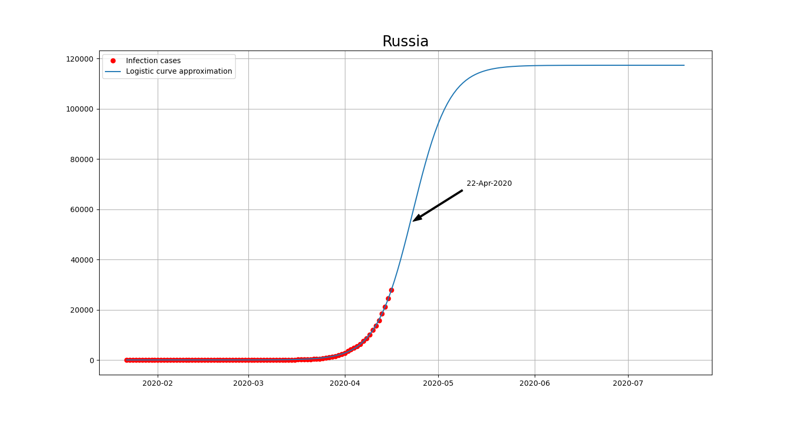

# covid-19

## Description
Draws graph of infection cases with logistical curve approximation and inflection point on latest infection data from Johns Hopkins.
Latest image for Russia can be found at https://tarpaha.ru/covid-19/
## How to run
### Windows
Requirements:
* wget
* python3 with numpy, scipy and matplotlib

Run `run.cmd` and look for result in the `out` folder
### Linux
Requirements:
* docker

Run `run.sh` and look for result in the `out` folder
## Result example

